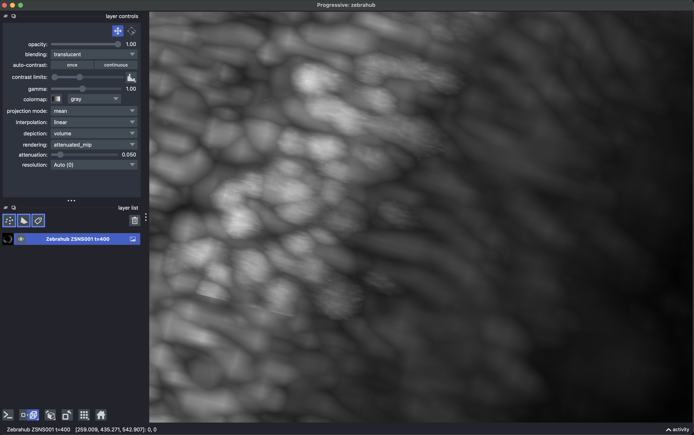
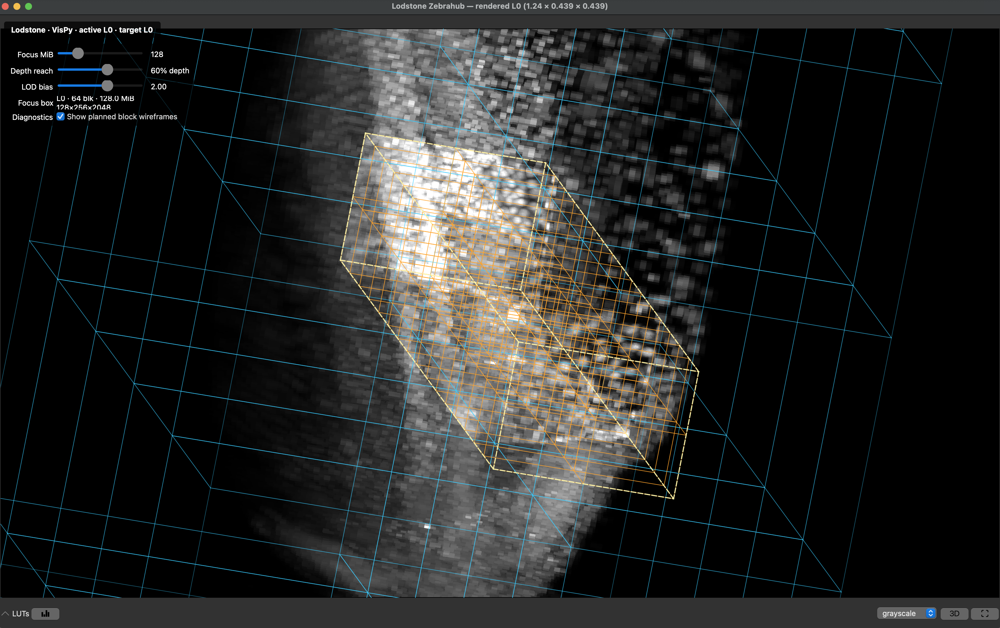
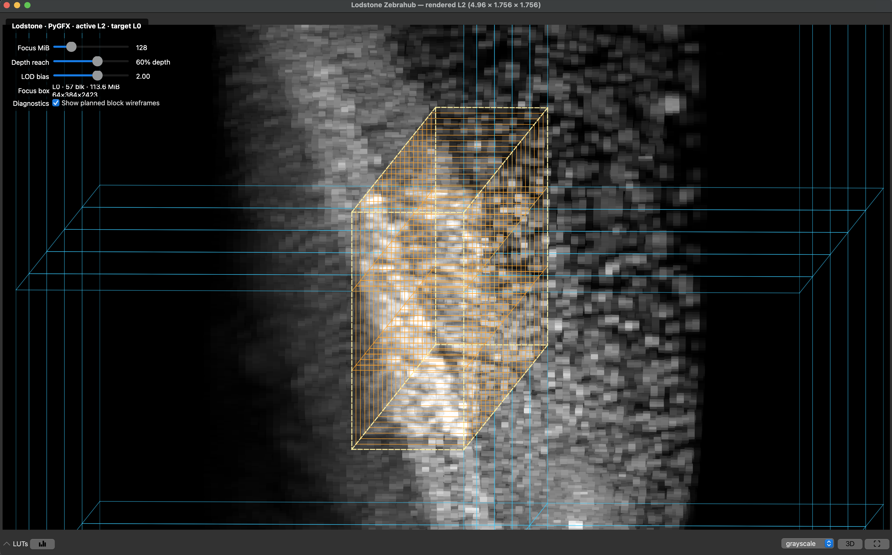
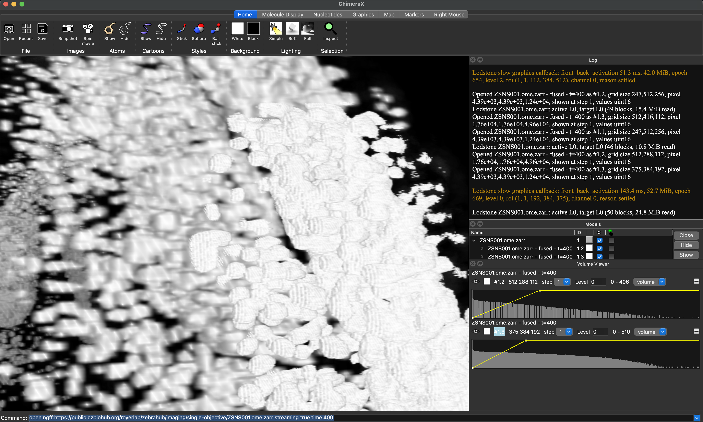

# Lodstone

Lodstone is a renderer-neutral engine for view-dependent streaming of
multiscale chunked arrays. Given a pyramid, camera, and renderer target, it
selects visible levels and chunks, prioritizes them by visual value, and
delivers updates without blocking the viewer.

Lodstone is an alpha. The core supports Python 3.11–3.14 and only requires
NumPy. Viewer integrations currently use development branches while their
streaming APIs stabilize.

## Install

```bash
pip install lodstone==0.1.0a1
pip install "lodstone[ome-zarr]==0.1.0a1"  # remote OME-Zarr sources
```

For the runnable viewer demos below, clone Lodstone so the example scripts are
available:

```bash
git clone --depth 1 https://github.com/kephale/lodstone.git
cd lodstone
```

All commands use the public ZSNS001 Zebrahub light-sheet dataset at timepoint
400. Clone the viewer repositories next to `lodstone`, giving this layout:

```text
work/
├── lodstone/
├── napari/
├── ndv/
└── chimerax-ome-zarr/
```

## Run with napari

The napari integration uses a single multiscale layer, bounded resident
intervals, partial texture uploads, and a shared Lodstone runtime.

```bash
cd ..
git clone --depth 1 --single-branch --branch lodstone-integration \
  https://github.com/kephale/napari.git
cd napari
python3 -m venv .venv
.venv/bin/python -m pip install -e ".[pyqt6,progressive]"
.venv/bin/python -m pip install -e "../lodstone[ome-zarr]"

cd ../lodstone
../napari/.venv/bin/python examples/napari_zebrahub.py \
  --time 400 --ndisplay 3
```

Add `--trace-chunks` to log plans, cache hits, source reads, and evictions, or
`--diagnostic-levels` to color pixels by the pyramid level that supplied them.

[](img/lodstone_napari.png)

## Run with ndv

Both ndv backends use the same source, planner, runtime, and dense clipmap
target. Only the canvas renderer changes.

```bash
cd ..
git clone --depth 1 --single-branch --branch lodstone-integration \
  https://github.com/kephale/ndv.git
cd ndv
python3 -m venv .venv
.venv/bin/python -m pip install -e ".[pyqt,vispy,pygfx]"
.venv/bin/python -m pip install -e "../lodstone[ome-zarr]"

cd ../lodstone
../ndv/.venv/bin/python examples/ndv_dense.py \
  --backend vispy --time 400
```

Close the VisPy window, then run the identical data path with PyGFX:

```bash
../ndv/.venv/bin/python examples/ndv_dense.py \
  --backend pygfx --time 400
```

| VisPy | PyGFX |
| --- | --- |
| [](img/lodstone_ndv_vispy.png) | [](img/lodstone_ndv_pygfx.png) |

## Run with ChimeraX

The ChimeraX integration is provided by the OME-Zarr bundle's streaming
branch. The commands below use ChimeraX Daily on macOS; adjust
`CHIMERAX_PYTHON` and `CHIMERAX` for another installation.

```bash
cd ..
git clone --depth 1 --single-branch --branch codex/lodstone-streaming \
  https://github.com/kephale/chimerax-ome-zarr.git
cd chimerax-ome-zarr

export CHIMERAX=/Applications/ChimeraX_Daily.app/Contents/bin/ChimeraX
export CHIMERAX_PYTHON=/Applications/ChimeraX_Daily.app/Contents/bin/python3.14

"$CHIMERAX_PYTHON" -m pip install --no-deps --force-reinstall ../lodstone
PYTHONPATH="$PWD" "$CHIMERAX_PYTHON" -m chimerax.core --nogui --exit \
  --cmd "devel build ."
"$CHIMERAX_PYTHON" -m chimerax.core --nogui --exit --cmd \
  "toolshed install $PWD/dist/chimerax_ome_zarr-1.0.0a1-py3-none-any.whl noDeps true reinstall true"

"$CHIMERAX" --cmd \
  "open ngff:https://public.czbiohub.org/royerlab/zebrahub/imaging/single-objective/ZSNS001.ome.zarr streaming true"
```

Restart ChimeraX after replacing Lodstone or reinstalling the bundle.

[](img/lodstone_chimera_ome_zarr.png)

## How it fits

```text
Source + View + Target
          │
        Planner
          │
        Stream
```

- `Source` exposes pyramid metadata and asynchronous regional reads.
- `View` captures displayed axes, selections, viewport, and camera matrix.
- `Target` describes renderer residency and applies completed updates.
- `Planner` selects visible levels and chunks within the target budget.
- `Stream` owns scheduling, cancellation, caching, batching, and stale-work
  rejection.

Storage chunks and display tiles are independent. A renderer may request small
bricks while a remote Zarr source stores larger chunks; Lodstone coalesces and
caches the native reads needed to assemble those updates. Multiple layers can
share one `Runtime` while retaining independent stream state.

Dense viewers can reuse Lodstone's complete coarse-to-fine publication path by
implementing the small `DenseCanvas` and `DenseHandle` protocols. A host that
also implements `CameraDenseCanvas` receives debounced camera replanning from
`DenseController`; ndv's VisPy and PyGFX canvases are the reference
implementations. See [Dense host integration](docs/dense-hosts.md) for the
contract and lifecycle.

See [Camera-aware multiscale rendering](docs/rendering-architecture.md) for the
planner math and the roadmap for metadata culling, sharding, and virtual
texture residency.

For comparable measurements across hosts and rendering backends, see
[Performance telemetry](docs/performance-telemetry.md). Lodstone records planned,
source, delivered, staging, and host-dispatch work; render targets may add GPU
upload and presentation metrics without exposing renderer APIs to the core.

## Viewer status

| Viewer | Integration | Status |
| --- | --- | --- |
| ChimeraX OME-Zarr | [PR 22](https://github.com/uermel/chimerax-ome-zarr/pull/22) | 3-D clipmap streaming; visually validated |
| napari | [integration PR 34](https://github.com/kephale/napari/pull/34) | Image and Labels; visually validated |
| ndv + VisPy | `kephale/ndv:lodstone-integration` | Reference ndv backend; visually validated |
| ndv + PyGFX | `kephale/ndv:lodstone-integration` | Same data path; visually validated |
| SceneX | Lodstone `SceneXController` | Dense 2-D/3-D streaming for VisPy and PyGFX |

SceneX views can use the same camera-aware dense path without either project
depending on a particular renderer:

```python
from lodstone.adapters import SceneXController

controller = SceneXController(view, source)
controller.update_from_scene()
```

The controller creates ordinary SceneX `Image` or `Volume` models, replans on
camera changes, and reports dense data submissions and presentations through
the standard Lodstone performance snapshot.

Integrations should pin an exact Lodstone prerelease. Compatibility is claimed
only for combinations covered by native tests and visual smoke tests.

## Develop

```bash
uv run --extra test pytest
uv run --group dev ruff check .
uv run --group dev pyright src
```

The test suite is network-independent. See [CHANGELOG.md](CHANGELOG.md),
[RELEASING.md](RELEASING.md), and the
[renderer architecture](docs/rendering-architecture.md) for deeper reference
material.
